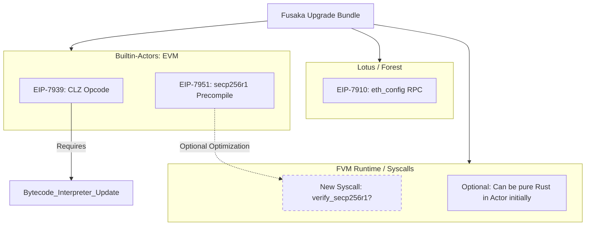

# Fusaka Implementation Dependencies

This document maps the dependency graph for implementing the Fusaka upgrade on FVM.

**Note on Gas Changes:**
FVM gas accounting is based on Wasm execution metering handled by the FVM Runtime. Ethereum's gas schedule changes (EIP-7883 ModExp repricing, EIP-7935 60M limit, etc.) are **not applicable** and will not be implemented. We rely on the native FVM gas model.

## Implementation Order

1.  **Phase A: Core Logic (Prototype)**
    *   Implement `CLZ` logic (Rust).
    *   Implement `secp256r1` verification logic (Rust, `p256` crate).
2.  **Phase B: Actor Integration (Spec)**
    *   Define Precompile Address for `secp256r1`.
    *   *Note: ModExp gas changes are skipped as FVM relies on Wasm metering.*
3.  **Phase C: Client Integration**
    *   Spec out `eth_config` response fields.