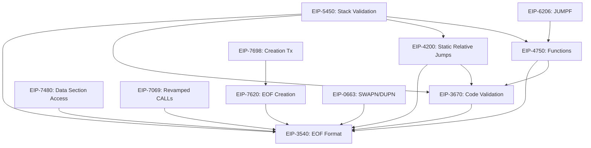

# EOFv1 Dependency Graph

## Optimal Implementation Order

1.  **Core Structure**: EIP-3540 (Format) & EIP-3670 (Validation Basics).
    *   Implement `Bytecode` struct changes to support container parsing.
    *   Implement basic validator framework.
2.  **Control Flow**: EIP-4200 (Static Jumps) & EIP-4750 (Functions).
    *   Add `RJUMP*` instructions.
    *   Add `CALLF`/`RETF` and return stack logic.
3.  **Extended Validation**: EIP-5450 (Stack Validation).
    *   Implement the stack height validation pass (relies on control flow graph from step 2).
4.  **New Features**:
    *   EIP-7480 (Data Access) - Independent after Core.
    *   EIP-0663 (SWAPN/DUPN) - Independent after Core.
    *   EIP-6206 (JUMPF) - Depends on Functions.
    *   EIP-7069 (Calls) - Independent after Core.
5.  **Creation & Transactions**: EIP-7620 (Creation) & EIP-7698 (Tx).
    *   Requires Core and potentially Feature opcodes to be settled.
    *   Hooks into `initialize_evm_contract` and transaction processing.
